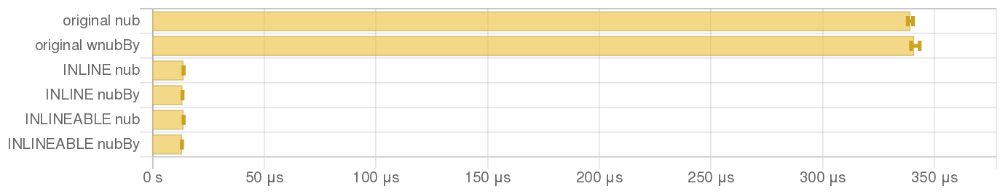

# va-bench

This repository is for benchmarking the [`vector-algorithms`](https://github.com/erikd/vector-algorithms) package, primarily for PRs.

## Setup

- Install GHC 9.8.4 with LLVM enabled
- Or, run `direnv allow` if you have Nix Flakes setup

## How to run

Benchmarks can be run with [`just`](https://github.com/casey/just). See [`Justfile`](./Justfile) for the recipes.

## Benchmark results

### 1. `inline-sort`

The `sort` function in `Intro` module should be marked as `INLINE`, but `INLINEABLE`:

### 2. `sort-vs-sort-by`

Other `sort` functions should also be marked as `INLINE`:

### 3. `nub`

`nub` and `nubBy` should be marked as `INLINE`. `nubByMut` should be atleast marked as `INLINEABLE`:

