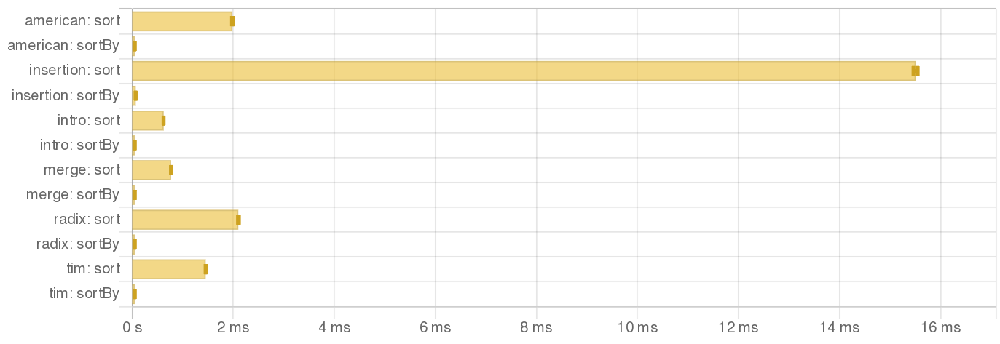

# va-bench

This repository is for benchmarking the [`vector-algorithms`](https://github.com/erikd/vector-algorithms) package, primarily for PRs.

## Setup

- Install GHC 9.8.4 with LLVM enabled
- Or, run `direnv allow` if you have Nix Flakes setup

## How to run

Benchmarks can be run with [`just`](https://github.com/casey/just). See [`Justfile`](./Justfile) for the recipes.

## Benchmark results

### 1. `inline-sort`

The `sort` function in `Intro` module should be marked as `INLINE`, not `INLINEABLE`:


### 2. `sort-vs-sort-by`

Other `sort` functions should also be marked as `INLINE` to be as fast as `sortBy compare`:



### 3. `nub`

`nub` and `nubBy` should be marked as `INLINE`. `nubByMut` should be atleast marked as `INLINEABLE`:


## Core output inspection

I'm not a Haskell pro, but let's look into `.dump-prep` files with my best effort:

```sh
$ cabal clean
$ just dump
$ cd dist-newstyle
build/x86_64-linux/ghc-9.8.4/va-bench-0.1.0.0/b/inline-sort/opt/build/inline-sort/inline-sort-tmp/bench/InlineSort.dump-prep
build/x86_64-linux/ghc-9.8.4/va-bench-0.1.0.0/b/nub/opt/build/nub/nub-tmp/bench/Nub.dump-prep
build/x86_64-linux/ghc-9.8.4/va-bench-0.1.0.0/b/sort-vs-sort-by/opt/build/sort-vs-sort-by/sort-vs-sort-by-tmp/bench/SortVsSortBy.dump-prep
build/x86_64-linux/ghc-9.8.4/va-bench-0.1.0.0/opt/build/src/Common.dump-prep
build/x86_64-linux/ghc-9.8.4/va-bench-0.1.0.0/opt/build/src/Common.dyn.dump-prep
build/x86_64-linux/ghc-9.8.4/va-bench-0.1.0.0/opt/build/src/Intro/Inline.dump-prep
build/x86_64-linux/ghc-9.8.4/va-bench-0.1.0.0/opt/build/src/Intro/Inline.dyn.dump-prep
build/x86_64-linux/ghc-9.8.4/va-bench-0.1.0.0/opt/build/src/Intro/StToPrim.dump-prep
build/x86_64-linux/ghc-9.8.4/va-bench-0.1.0.0/opt/build/src/Intro/StToPrim.dyn.dump-prep
build/x86_64-linux/ghc-9.8.4/va-bench-0.1.0.0/opt/build/src/Nub/Inline.dump-prep
build/x86_64-linux/ghc-9.8.4/va-bench-0.1.0.0/opt/build/src/Nub/Inline.dyn.dump-prep
build/x86_64-linux/ghc-9.8.4/va-bench-0.1.0.0/opt/build/src/Nub/Inlineable.dump-prep
build/x86_64-linux/ghc-9.8.4/va-bench-0.1.0.0/opt/build/src/Nub/Inlineable.dyn.dump-prep
```

### 1. `inline-sort`

Look into `InlineSort.dump-prep`.

The call to `Data.Vector.Algorithms.Intro.sort` seems like not specialized, as we're seeing `PrimMonad` not `ST`. Especially `$fPrimMonadST0`, it's a dictionary-passing style:

```
                  case ((Data.Vector.Algorithms.Intro.sort
                           @(GHC.ST.ST GHC.Prim.RealWorld)
                           @Data.Vector.Unboxed.Base.MVector
                           @GHC.Types.Int
                           (Control.Monad.Primitive.$fPrimMonadST0 @GHC.Prim.RealWorld)
                           Data.Vector.Unboxed.Base.$fMVectorMVectorInt
                           GHC.Classes.$fOrdInt
                           sat_s7Vb)
                        `cast` (GHC.ST.N:ST[0] <GHC.Prim.RealWorld>_N <()>_R
                                :: GHC.ST.ST GHC.Prim.RealWorld ()
                                   ~R# GHC.ST.STRep GHC.Prim.RealWorld ()))
                         (s'#1_s7Va
                          `cast` ((GHC.Prim.State#
                                     (Control.Monad.Primitive.D:R:PrimStateST0[0]
                                          <Control.Monad.Primitive.PrimState
                                             (GHC.ST.ST GHC.Prim.RealWorld)>_N
                                      ; Control.Monad.Primitive.D:R:PrimStateST0[0]
                                            <GHC.Prim.RealWorld>_N))_R
                                  :: GHC.Prim.State#
                                       (Control.Monad.Primitive.PrimState
                                          (GHC.ST.ST
                                             (Control.Monad.Primitive.PrimState
                                                (GHC.ST.ST GHC.Prim.RealWorld))))
                                     ~R# GHC.Prim.State# GHC.Prim.RealWorld))
```

There's no `Data.Vector.Algorithms.Intro.sortBy` call. It seems like inlined (I guess).

### 2. `sort-vs-sort-by`

Look into `SortVsSortBy.dump-prep`. I did not yet, but something similar could be observed.

### 3. `nub`

Look into `Nub.dump-prep`. I did not yet, but something similar could be observed.

